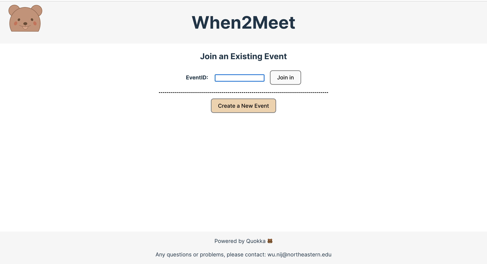

# When2Meet
**When2Meet** is a collaborative scheduling tool that helps users find the best time for a group of people to meet. The platform allows users to create new events or join existing ones by entering an EventID. Each event offers a visual calendar interface to easily select available times, automatically adjusting for time zones, making it effortless for participants from different regions to coordinate.

## Features
* Create New Events: Set up a new meeting by specifying available dates and times within a flexible calendar interface.

* Join Existing Events: Enter an EventID to participate in an event, add your availability, and see when others are available.

* Time Zone Adjustment: Automatically adjusts displayed times based on the user's selected time zone, removing the need for manual conversion.

* Visual Availability Display: Availability for each time slot is shown in color-coded format, where deeper colors indicate higher availability across participants.

* Polling Group Availability Display: The group availability is dynamically updated every 10 seconds to ensure that all users have the most current information.

## Built With
This section list frameworks/libraries used in project:
* [React](https://reactjs.org/) - JavaScript library for building user interfaces
* [Express](https://expressjs.com/) - Fast, unopinionated, minimalist web framework for Node.js
* [Moment-Timezone](https://momentjs.com/timezone/) - Parse and display dates in any timezone
* [React-Selecto](https://daybrush.com/selecto/) - React component that allows you to select elements in the drag area using the mouse or touch

## Getting Started
These instructions will get you a copy of the project up and running on your local machine for development and testing purposes.

### Prerequisites
* git clone https://github.com/seainfo6250/student-seainfo6250--NijiaW/tree/aefd06eac165a42fac23f1d2feb5cb18a0c13d25/final

### Installing
This application can be tested by running ***npm install*** and
running  ***npm start*** to start the services server on port 3000 

## Usage
- **Creating an Event**
  1. Access the Create Event Page: Navigate to the Home page and click on "Create a New Event".
  2. Fill up Event Title, Set Date, Time Range and Time Zone: Start by filling up an Event Title, select your desired dates (within a month) and the time range (e.g., 9 AM to 5 PM) in prefered time zone.
  
- **Joining an Event**
  1. Enter EventID: On the home page, input the EventID created from the event organizer.
  2. Log In: Enter your name and select your time zone.
  3. Mark Availability: Click on the half-hour slots to add your availability to the group's schedule

- Login and Fill Out Availability: 
   -  Once the event is created, users can login to select half-hour slots by "drag and select" to set personal availability and view group's availability.
   -  Save and Share: Save the event and share the generated EventID with other participants.

## Contacts
Nijia Wu - wu.nij@northeastern.edu

## Acknowledgments
* All images used in this project were self-drawn and are owned by Nijia 

